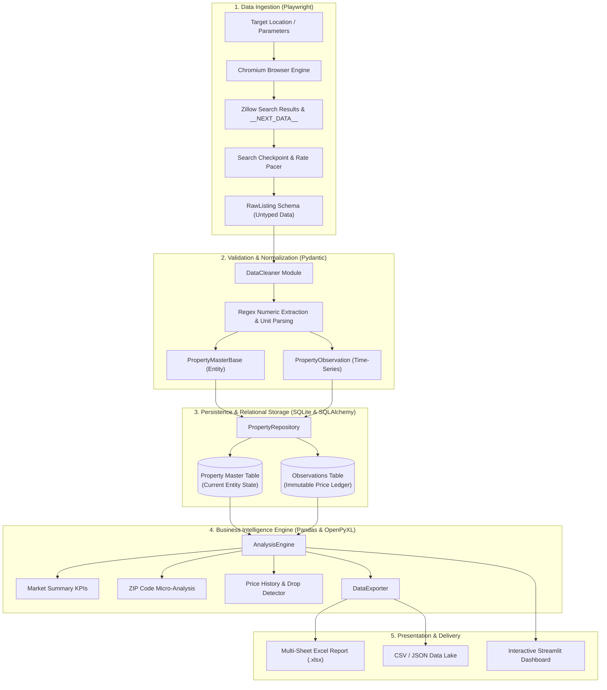
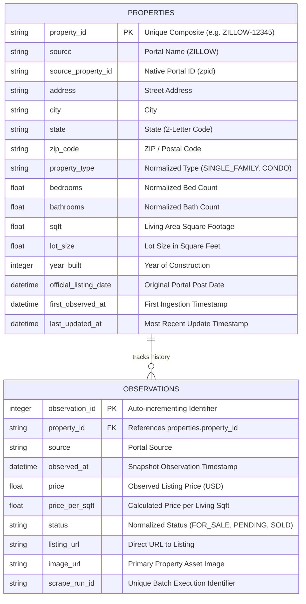

# 🏘️ Real Estate Property Data & Market Intelligence Platform

[](https://www.python.org/)
[](https://playwright.dev/)
[](https://streamlit.io/)
[](https://docs.pydantic.dev/)
[](https://www.sqlalchemy.org/)
[](https://pandas.pydata.org/)
[](https://docs.pytest.org/)
[](#)

> **Enterprise-grade property data extraction, historical price tracking, micro-market intelligence, and reporting platform.**  
> Built with robust anti-bot mitigation, strict two-tier data validation, time-series ledgering, and a high-performance interactive Streamlit dashboard.

---

## 📑 Table of Contents

- [Executive Summary & Business Value](#-executive-summary--business-value)
  - [Business Problem](#business-problem)
  - [Strategic Value Proposition & ROI](#strategic-value-proposition--roi)
  - [Target Stakeholders & Personas](#target-stakeholders--personas)
  - [Key Performance Indicators (KPIs) Captured](#key-performance-indicators-kpis-captured)
- [System Architecture & Engineering Design](#-system-architecture--engineering-design)
  - [End-to-End Pipeline Architecture](#end-to-end-pipeline-architecture)
  - [Data Model & Relational Schema Design](#data-model--relational-schema-design)
  - [Ingestion & Anti-Bot Strategy](#ingestion--anti-bot-strategy)
  - [ETL Normalization & Deduplication](#etl-normalization--deduplication)
  - [Analytics & Business Intelligence Engine](#analytics--business-intelligence-engine)
- [Streamlit Dashboard (Interactive UI)](#-streamlit-dashboard-interactive-ui)
- [Data Export Suite & Deliverables](#-data-export-suite--deliverables)
- [Project Directory Structure](#-project-directory-structure)
- [Installation & Environment Setup](#-installation--environment-setup)
- [Usage Guide](#-usage-guide)
  - [1. Interactive Dashboard (Streamlit)](#1-interactive-dashboard-streamlit)
  - [2. Command Line Interface (CLI)](#2-command-line-interface-cli)
- [Testing & Quality Assurance](#-testing--quality-assurance)
- [Engineering Guidelines & Anti-Bot Philosophy](#-engineering-guidelines--anti-bot-philosophy)
- [Future Roadmap & Enterprise Extensibility](#-future-roadmap--enterprise-extensibility)

---

## 💼 Executive Summary & Business Value

### Business Problem
In modern real estate investing, brokerage operations, and asset management, access to timely, high-fidelity listing data is fragmented and hindered by prohibitive portal fees, aggressive bot mitigations, and inconsistent data formatting. Critical investment signals—such as **sub-market price-per-square-foot anomalies**, **silent price reductions**, and **inventory velocity shifts**—often go undetected when relying on manual portal searches or delayed third-party reports.

### Strategic Value Proposition & ROI
The **Real Estate Property Data & Market Intelligence Platform** provides an autonomous, end-to-end pipeline that transforms raw listing web pages into structured, longitudinal market intelligence:
1. **Zero Information Asymmetry**: Continuously captures listing prices, property characteristics, and status changes across target geographies.
2. **Longitudinal Price History Ledger**: Maintains an immutable observation history that tracks property price cuts, appreciation trends, and listing status progressions over time.
3. **Hyper-Localized Micro-Market Intelligence**: Automatically segments and aggregates data by ZIP code, isolating undervalued micro-markets and identifying macro outliers.
4. **Immediate Executive Deliverables**: Generates multi-worksheet formatted Excel workbooks (`.xlsx`), standardized CSV data lakes, and structured JSON payloads for downstream data science models or stakeholder presentations.
5. **No Code Barrier**: Empowers non-technical analysts, brokers, and investors via a streamlined, single-pane Streamlit web interface.

### Target Stakeholders & Personas

| Persona | Core Use Case | Primary Feature Leveraged |
| :--- | :--- | :--- |
| **Real Estate Investors & PE Funds** | Identify undervalued acquisitions, motivated sellers, and margin opportunities via price cuts. | Price History Tab, Price Cut Worksheets, $/Sqft Distribution. |
| **Brokers & Listing Agents** | Perform hyper-local Comparative Market Analysis (CMA) and monitor competitor listings. | ZIP-Code Location Analysis, Property Master Inventory Table. |
| **Market Economists & Appraisers** | Track median price shifts, inventory absorption, and price variance per neighborhood. | Market Summary KPIs, Price Distribution Histograms, CSV Exports. |
| **Data Engineers & Quant Analysts** | Ingest clean, typed, deduplicated property feeds into proprietary valuation models. | Pydantic Schema, Relational SQLite DB, Automated JSON/CSV Pipelines. |

### Key Performance Indicators (KPIs) Captured
- **Total Tracked Inventory**: Volume of active and historical properties per targeted search cluster.
- **Central Tendency Metrics**: Real-time **Mean** and **Median** price calculations resilient to luxury outlier skew.
- **Unit Economics**: **Average, Min, and Max Price per Square Foot ($/sqft)** for standardized cross-property comparison.
- **Price Volatility & Reductions**: Frequency of price drops, average dollar reduction, and average percentage discount.
- **Status Lifecycle Metrics**: Transitions from `FOR_SALE` to `PENDING` and `SOLD`.

---

## 🏛️ System Architecture & Engineering Design

The platform is designed following clean architecture principles, separating concerns across five decoupled layers: Ingestion, Processing/Validation, Persistence, Analytics, and Presentation.



---

### Data Model & Relational Schema Design

The persistence tier employs a **Slowly Changing Dimension (SCD Type 1 + Ledger)** design pattern:
1. **`PropertyModel` (`properties`)**: Represents the physical asset master record. It stores immutable or slowly changing attributes (address, city, state, zip code, bedrooms, bathrooms, square footage, lot size, year built). It maintains `first_observed_at` and `last_updated_at` timestamps.
2. **`ObservationModel` (`observations`)**: Represents a point-in-time snapshot. It stores volatile market variables (price, price per square foot, status, listing URL, image URL, scrape run ID, timestamp) linked via foreign key to `property_id`.



---

### Ingestion & Anti-Bot Strategy

Modern real estate portals implement sophisticated anti-scraping protections (Cloudflare, PerimeterX, WAF fingerprinting). The scraper was specifically engineered to bypass conventional scraping failure points:

- **Search-Page Level Ingestion via `__NEXT_DATA__`**: Rather than scraping the search page and visiting each property detail URL individually—which triggers rapid 403 HTTP blocks and CAPTCHA rate limits—the scraper extracts the hydrated Next.js JSON state directly from the search results page. A single page request yields up to 40 rich listings.
- **Headful/Visible Browser Support**: High-security portals immediately detect and challenge headless browser fingerprints. The scraper includes a visible browser toggle (`--visible` or UI checkbox) that renders full browser headers, native viewport rendering, and standard client window interactions.
- **Stateful Checkpointing**: Execution state is maintained in `data/scrape_checkpoint.json`. If a search session is interrupted or encounters rate throttling, subsequent executions can resume from the last indexed page.
- **Graceful Fault Isolation**: If an anti-bot challenge occurs, the scraper halts without data corruption, logs a diagnostic warning, persists all collected listings up to that moment, and exits cleanly.

---

### ETL Normalization & Deduplication

Raw data pulled from web portals is notoriously irregular and noisy. The processing pipeline enforces strict data hygiene before database insertion:

1. **Two-Tier Schema Architecture**:
   - `RawListing` (Pydantic): Captures loose string payloads (`price_raw`, `bedrooms_raw`, `lot_size_raw`, etc.) without throwing validation exceptions during extraction.
   - Domain Cleaners (`DataCleaner`):
     - Sanitizes currencies (`"$1,249,000 / mo"` &rarr; `1249000.0`).
     - Normalizes land measurements (converting acres to square feet using the standard `1 acre = 43,560 sqft` ratio).
     - Standardizes property types (`SingleFamilyResidence` &rarr; `SINGLE_FAMILY`, `Apartment` &rarr; `CONDO`).
     - Maps statuses to standardized states (`ACTIVE`, `FOR_SALE`, `PENDING`, `SOLD`).
2. **Idempotent Upsert & Deduplication**:
   - Deduplication uses composite keys (`source` + `source_property_id`).
   - Observations are deduplicated: if a consecutive scrape detects identical price and status for a property, redundant observation records are skipped, preventing database bloat while capturing authentic historical adjustments.

---

### Analytics & Business Intelligence Engine

The `AnalysisEngine` runs in-memory pandas operations over the relational database:
- **Resilient Computation**: Computes summary statistics across any dataset size, including graceful fallbacks for empty tables and null fields.
- **ZIP-Code Micro-Aggregation**: Groups metrics by geographic postal codes, outputting listing counts, mean/median prices, and $/sqft benchmarks.
- **Time-Series Delta Tracking**: Calculates longitudinal metrics across property observations:
  - `current_price` vs. `previous_price` vs. `first_observed_price`
  - Total absolute dollar delta (`total_change`)
  - Percentage price fluctuation (`percentage_change`)
  - Detection of motivated sellers (properties with negative price changes)
- **Automated Descriptive Insights**: Generates plain-English market summaries identifying the most common property layouts, highest and lowest priced ZIP codes, and top price cuts.

---

## 🖥️ Streamlit Dashboard (Interactive UI)

The platform includes an executive web dashboard implemented with **Streamlit** (`app_ui.py`), providing an interactive, zero-code interface for scraping, market analysis, and reporting.

```
┌───────────────────────────┬────────────────────────────────────────────────────────┐
│ 🔍 Scraper Controls       │  🏠 Real Estate Market Intelligence                    │
│ ───────────────────────── │  📊 Market Overview                                    │
│ Location: [Seattle, WA  ] │  [Properties] [Avg Price] [Median] [Price Range] [$/Sqft]
│ Max Listings: [   20    ] │                                                        │
│ [ ] Headless Mode         │  💡 Market Insights                                    │
│ [ ▶ Run Scraper         ] │  • Most common: 3 beds (22 properties)                 │
│                           │  • Top ZIP: 98105 ($2,511,000)                         │
│ ───────────────────────── │ ────────────────────────────────────────────────────── │
│ 📅 Last Update:           │  [🏠 Listings] [📍 ZIP Analysis] [📈 Price History] [📥 Exports]
│ Oct 10 2026, 23:05        │  ┌──────────────────────────────────────────────────┐  │
│ 🏠 51 properties in DB    │  │ Interactive filterable dataframe with Zillow     │  │
│                           │  │ links, bed/bath metrics, price distribution chart│  │
│                           │  └──────────────────────────────────────────────────┘  │
└───────────────────────────┴────────────────────────────────────────────────────────┘
```

### Dashboard Features
- **Sidebar Scraper Control**: Trigger real-time property scraping directly from the UI with configurable locations, maximum listing limits, and headless/visible browser switching.
- **Market KPI Overview**: Live metric cards displaying total properties tracked, average price, median price, price range, and average price per square foot.
- **AI/Analytical Insights Bar**: Highlight box summarizing the most common floorplans, peak ZIP code valuations, and notable price cuts.
- **Tab 1: Property Listings**: Filterable data table (search by address/city, filter by status or property type) with direct clickable links to live portal listings and a dynamic price distribution histogram.
- **Tab 2: Location Analysis**: Grouped micro-market table breaking down metrics by postal code.
- **Tab 3: Price History & Status Changes**: Longitudinal tracking table highlighting properties with price reductions and status updates.
- **Tab 4: Downloads**: Direct browser download buttons for the multi-tab Excel report and CSV datasets.
- **Optimized Caching**: Uses `@st.cache_resource` for safe database connection pooling without `UnhashableTypeError` exceptions, auto-refreshing when new data is scraped.

---

## 📦 Data Export Suite & Deliverables

Every analysis run produces an enterprise-ready suite of export deliverables stored in `data/exports/`:

| File Name | Format | Description / Target Audience |
| :--- | :---: | :--- |
| **`market_report.xlsx`** | Multi-Sheet Excel | **Executive Workbook** featuring dedicated worksheets: *Market Summary*, *Properties*, *Observations*, *Location Analysis*, *Price History*, *Price Reductions*, and *Property Comparison*. Timezone-neutralized and formatted for presentation. |
| **`properties.csv`** | CSV | Master record of all unique properties, coordinates, and physical specifications. |
| **`observations.csv`** | CSV | Complete historical log of every observed price and status point. |
| **`location_analysis.csv`** | CSV | Aggregated micro-market metrics grouped by ZIP code. |
| **`price_history.csv`** | CSV | Property-level price delta tracking (first seen, last seen, total change, % change). |
| **`property_comparison.csv`**| CSV | Flattened comparative dataset joining master attributes with latest observation data. |
| **`market_summary.csv`** | CSV | One-row summary of top-level market health metrics. |
| **`analysis_results.json`** | JSON | Structured machine-readable summary and analytical insights for API consumption. |
| **`property_records.json`** | JSON | Full property master catalog in serialized JSON format. |
| **`price_history.json`** | JSON | Serialized price-history dataset with ISO-formatted timestamps. |

---

## 📂 Project Directory Structure

```plaintext
real-estate-web-scrapper/
├── app/
│   ├── analysis/
│   │   ├── __init__.py
│   │   ├── engine.py              # In-memory Pandas analytics & market insights
│   │   └── exporter.py            # Multi-sheet Excel (.xlsx), CSV, and JSON exporter
│   ├── database/
│   │   ├── __init__.py
│   │   ├── db.py                  # SQLAlchemy engine & declarative base
│   │   ├── repository.py          # Upsert logic, deduplication & historical summary queries
│   │   └── schema.py              # PropertyModel & ObservationModel relational tables
│   ├── models/
│   │   ├── __init__.py
│   │   ├── property.py            # Pydantic domain models (Master & Observation)
│   │   └── raw.py                 # Untyped RawListing ingestion schema
│   ├── processing/
│   │   ├── __init__.py
│   │   ├── cleaner.py             # Data sanitization, regex parsers & unit normalization
│   │   └── pipeline.py            # Validation, mapping & database repository dispatcher
│   ├── scraper/
│   │   ├── __init__.py
│   │   ├── base.py                # Abstract BaseScraper interface
│   │   └── zillow.py              # Playwright browser automation & __NEXT_DATA__ extractor
│   ├── config.py                  # Pydantic Settings (DB_PATH, LOG_LEVEL, .env support)
│   └── logger.py                  # Unified console & rotating file logging (data/logs/)
├── data/
│   ├── db/                        # SQLite database storage (real_estate.sqlite)
│   ├── exports/                   # Output directory for Excel, CSV, and JSON reports
│   └── logs/                      # Application execution logs (app.log)
├── docs/
│   ├── IMPLEMENTATION_CHECKLIST.md# Backend Phase 1-5 engineering checklist
│   └── UI_IMPLEMENTATION_CHECKLIST.md # Streamlit UI implementation checklist
├── tests/
│   ├── test_analysis.py           # Tests for Pandas aggregations & report exporter
│   ├── test_database.py           # Unit tests for SQLAlchemy ORM & CRUD operations
│   ├── test_historical.py         # Tests for deduplication & price tracking logic
│   ├── test_processing.py         # Tests for regex cleaners, normalization & validation
│   └── test_scraper.py            # Scraper tests with mocked Next.js hydration payloads
├── app_ui.py                      # Interactive Streamlit Web Application
├── main.py                        # Unified Command Line Orchestrator
├── requirements.txt               # Production Python dependencies
└── README.md                      # Comprehensive system documentation
```

---

## ⚙️ Installation & Environment Setup

### 1. Prerequisites
- **Python 3.10+** (tested on Python 3.12)
- **Node/Playwright browser dependencies** (Chromium)
- **Git**

### 2. Clone & Environment Initialization
```bash
# Clone the repository
git clone <repository_url>
cd "real-estate web scrapper"

# Create a virtual environment
python -m venv venv

# Activate the virtual environment
# Windows (PowerShell):
.\venv\Scripts\Activate.ps1
# Windows (CMD):
.\venv\Scripts\activate.bat
# macOS / Linux:
source venv/bin/activate
```

### 3. Install Dependencies
```bash
# Install core Python packages
pip install -r requirements.txt

# Install Playwright browser drivers
playwright install chromium
```

### 4. Configuration (Optional)
The system uses sane defaults (`sqlite:///data/db/real_estate.sqlite`). To configure custom paths or logging levels, create a `.env` file in the root directory:
```env
DB_PATH=sqlite:///data/db/real_estate.sqlite
LOG_LEVEL=INFO
```

---

## 🚀 Usage Guide

### 1. Interactive Dashboard (Streamlit)
The recommended way to operate the platform is via the Streamlit web dashboard:

```bash
streamlit run app_ui.py
```

- Opens automatically at `http://localhost:8501`.
- Enter your desired search market (e.g., `"Austin, TX"`, `"Seattle, WA"`, or `"Miami, FL"`).
- Select your target listing count.
- Keep **Headless Browser (Hidden)** unchecked for optimal bypass of portal security checks.
- Click **▶ Run Scraper** to execute the pipeline and explore results instantly.

---

### 2. Command Line Interface (CLI)
The system can also be executed programmatically or scheduled via cron using `main.py`:

#### Scrape Listings Only
```bash
# Scrape Austin, TX with visible browser (recommended)
python main.py --scrape --location "Austin, TX" --max-listings 20 --visible

# Scrape in headless mode (background automation)
python main.py --scrape --location "Seattle, WA" --max-listings 50
```

#### Generate Market Intelligence & Exports Only
Loads existing data from the SQLite database and regenerates all Excel, CSV, and JSON deliverables in `data/exports/`:
```bash
python main.py --analyze
```

#### Run End-to-End (Scrape + Ingest + Analyze)
```bash
python main.py --scrape --location "Denver, CO" --max-listings 30 --visible --analyze
```

#### CLI Reference
| Flag | Type | Default | Description |
| :--- | :---: | :---: | :--- |
| `--scrape` | Flag | `False` | Triggers the Playwright ingestion pipeline. |
| `--location` | String | `"Austin, TX"` | Target market (City, State or ZIP code). |
| `--max-listings` | Integer | `10` | Maximum number of listings to extract. |
| `--visible` | Flag | `False` | Runs browser with visible GUI (recommended for portal compliance). |
| `--analyze` | Flag | `False` | Computes market metrics and generates all export files. |

---

## 🧪 Testing & Quality Assurance

The codebase includes a comprehensive test suite with **23 unit and integration tests** built using `pytest`. The tests run using isolated SQLite memory instances and mocked HTTP/Playwright browser fixtures, ensuring complete test determinism.

```bash
# Run the complete test suite
pytest tests/ -v
```

### Test Suite Coverage Breakdown

```plaintext
tests/test_analysis.py
  ✓ test_engine_load_data                  - Verifies DataFrame loading & type conversion
  ✓ test_market_summary                    - Validates central tendency & metric calculations
  ✓ test_location_analysis                 - Validates ZIP code groupings and aggregates
  ✓ test_price_history                     - Validates time-series delta & % change calculation
  ✓ test_status_changes                    - Validates status transition counters
  ✓ test_empty_database_handling           - Ensures zero-crash handling on empty DB
  ✓ test_exporter                          - Verifies generation of Excel, CSV, and JSON files

tests/test_database.py
  ✓ test_pydantic_validation               - Verifies strict Pydantic model integrity
  ✓ test_upsert_property                   - Validates insert vs. update idempotency
  ✓ test_add_observation                   - Validates observation linking & FK integrity

tests/test_historical.py
  ✓ test_pipeline_deduplication            - Ensures redundant consecutive scrapes are skipped
  ✓ test_historical_summary                - Verifies price drop and appreciation summaries

tests/test_processing.py
  ✓ test_clean_price                       - Tests regex currency and string cleaners
  ✓ test_clean_lot_size                    - Tests acre-to-sqft conversion logic
  ✓ test_clean_status                      - Tests property status categorization
  ✓ test_clean_property_type               - Tests property type normalization
  ✓ test_clean_listing_valid               - Validates complete end-to-end cleaning
  ✓ test_clean_listing_missing_values      - Tests graceful handling of sparse data
  ✓ test_clean_listing_invalid             - Validates isolation of malformed records

tests/test_scraper.py
  ✓ test_scraper_initialization            - Verifies run IDs and browser state setup
  ✓ test_scraper_search_mocked             - Tests __NEXT_DATA__ JSON parsing logic
  ✓ test_extract_property_details_json_ld  - Tests fallback JSON-LD parser
  ✓ test_scraper_captcha_handling          - Validates graceful exit on anti-bot challenge
```

---

## 🛡️ Engineering Guidelines & Anti-Bot Philosophy

> [!IMPORTANT]
> **Responsible & Sustainable Scraping Practices**
> - **Zero Invasive Evasion**: This project does not employ black-hat evasion techniques, cracked captcha services, or illegal payload injections.
> - **Publicly Rendered Data Only**: The pipeline exclusively accesses publicly delivered HTML and client-side `__NEXT_DATA__` JSON hydration tags delivered to regular web users.
> - **Search-Page Extraction**: By parsing all property attributes from search result payloads, the platform minimizes HTTP traffic by orders of magnitude compared to traditional detail-page scrapers.
> - **Polite Pacing**: Built-in pacing delays simulate human-like navigation behavior and avoid burdening public infrastructure.
> - **Visible Execution Support**: Cloudflare and PerimeterX bot detection can flag headless Chromium. Operating with visible browsers (`--visible` or leaving Headless unchecked in Streamlit) ensures maximum reliability.

---

## 🔮 Future Roadmap & Enterprise Extensibility

- [ ] **Multi-Portal Ingestion Adapters**: Extend `BaseScraper` to support Redfin, Realtor.com, and local MLS RETS/RESO web APIs.
- [ ] **Automated Valuation Modeling (AVM)**: Implement machine-learning regression models (XGBoost/LightGBM) to estimate fair-market property valuation and detect underpriced listings.
- [ ] **Automated Deal Alerts**: Integration with Slack, Discord, and Email webhooks when a property in a watched ZIP code drops by >5%.
- [ ] **Cloud Deployment**: Containerization with Docker and deployment profiles for AWS ECS/Fargate paired with an RDS PostgreSQL data store.
- [ ] **Geospatial Mapping**: Incorporate PyDeck/Folium interactive maps with price heatmaps directly into the Streamlit interface.

---

## 📄 License & Attribution

This project is open-source and distributed under the **MIT License**.  
Developed with high-standard software engineering and business intelligence principles.
